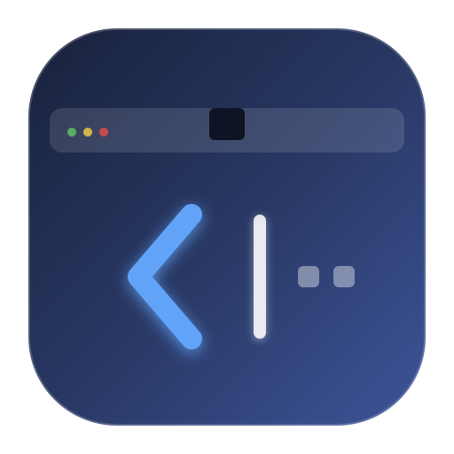

# MenuFold (菜单折叠)

<p align="center">
  
</p>

<p align="center">
  <strong>专为带有刘海屏的 MacBook 打造的优雅、超轻量开源菜单栏图标折叠与收纳工具</strong>
</p>

<p align="center">
  <a href="https://github.com/a916791360/MenuFold/releases/latest"></a>
  
  
  <a href="LICENSE"></a>
  <a href="README_EN.md"></a>
</p>

---

## 💡 为什么开发 MenuFold？

现在的 MacBook 几乎都配有前置摄像头刘海（Notch）。当我们在菜单栏常驻了较多应用（如微信、飞书、输入法、监控插件、VPN、网盘等）时，左侧的图标极容易**被刘海无情遮挡**，甚至直接被系统挤出屏幕导致无法点击，带来极差的使用体验。

**MenuFold** 采用极简的“箭头折叠”方案：
1. 启动后，菜单栏出现一个专属折叠箭头 `<` 与分隔线 `|`。
2. 按住键盘 **`⌘ (Command)`** 键，用鼠标将想要隐藏的图标拖拽到分隔线左侧。
3. 点击箭头，左侧的所有图标瞬间隐入箭头内；需要时再次点击即可秒级展开！

无需授予危险的辅助功能权限，纯原生 Swift + AppKit 实现，零内存泄漏，极致轻量（~30MB 内存占用，0% 常驻 CPU）。

---

## ✨ 核心特性

- 🎯 **原生 ⌘ + 拖拽收纳**：遵循 macOS 原生菜单栏重排机制，按住 `⌘` 随心拖动排序。
- 🪄 **一键折叠 / 展开**：轻点菜单栏箭头，多余图标立刻折叠，彻底告别刘海屏遮挡。
- ⚡ **超轻量与零权限**：无需任何无障碍权限或辅助功能权限，不常驻后台常态守护进程，绿色安全。
- 🚀 **现代架构**：
  - 基于最新 `SMAppService` 原生开机自启，告别传统旧版 Launcher 守护进程。
  - 完美适配 macOS 14 / macOS 15 Sequoia 及更高版本，解决老旧工具内存暴涨问题。
  - 支持全架构 Universal Binary（Apple Silicon M1/M2/M3/M4/M5 + Intel 芯片）。
- ⌨️ **全局快捷键**：支持全局热键 `⌘ + ⌥ + B`（Command + Option + B），键盘随手一击即可收拢展开。
- ⏱️ **智能自动折叠**：支持配置展开后 5s / 10s / 15s / 30s 自动折叠，用完即收，清爽无扰。
- 🎨 **外观高度定制**：
  - 箭头样式自由切换（经典折叠箭头 `< / >`、实心三角 `◀ / ▶`、极简圆环）。
  - 分隔线可选细线 `|`、圆点 `•` 或完全隐藏（Option + 点击箭头快速隐藏/显示分隔符）。
- 🔒 **永久隐藏专区**：可选开启第二道分隔线，将不常用的图标放置其后，即便展开也不会暴露。

---

## 🖥 界面与使用示意

```text
[折叠隐藏区]              [分隔线]  [折叠箭头]       [常驻可见区]
[微信] [网盘] [监控插件]  │   |   │     <     │  [Wi-Fi] [电池] [控制中心] [时间]
───────────────────────────────────────────────────────────────────────
                      ▼ 点击箭头折叠 ▼
[Notch 刘海]                      │     >     │  [Wi-Fi] [电池] [控制中心] [时间]
```

### 3步上手指南：
1. **启动 MenuFold**：菜单栏会出现一个折叠箭头 `<` 和一道细分隔线 `|`。
2. **整理图标**：按住键盘 `⌘` 键，按住鼠标左键拖动菜单栏图标。
   - 拖拽到**分隔线左侧**：归入折叠区，折叠时隐藏。
   - 拖拽到**分隔线右侧**：保持常驻，折叠时不隐藏。
3. **点击折叠**：点击箭头，隐藏区图标立即收纳，箭头变为 `>`；再次点击立即展开。

---

## 📥 下载与安装

### 方式一：下载发布包（推荐）

1. 前往 [GitHub Releases 最新发布页](https://github.com/a916791360/MenuFold/releases/latest)。
2. 下载 `MenuFold.dmg` 或 `MenuFold.zip`。
3. 双击打开 `MenuFold.dmg`，将 **MenuFold.app** 拖动到 **Applications**（应用程序）文件夹即可。
4. 首次打开如遇到系统安全提示，前往「系统设置」→「隐私与安全性」点击「仍要打开」即可。

### 方式二：从源码编译

本项目已包含完整的 Xcode 工程，本地有 Xcode 即可一键构建：

```bash
# 1. 克隆代码仓库
git clone https://github.com/a916791360/MenuFold.git
cd MenuFold

# 2. 一键编译并生成 Release 包 (DMG + ZIP)
./scripts/build_release.sh
```

或者直接在终端或 Xcode 中打开：
```bash
open MenuFold.xcodeproj
```

---

## ⚙️ 快捷操作与小贴士

| 操作 | 效果 |
| :--- | :--- |
| **单击箭头 (`<` / `>`)** | 切换折叠 / 展开状态 |
| **Option + 单击箭头** | 快速切换显示 / 隐藏分隔线 |
| **右键单击箭头或分隔线** | 打开快捷菜单（偏好设置、自动折叠、退出） |
| **⌘ + ⌥ + B (全局快捷键)** | 全局一键收起或展开菜单栏 |
| **按住 ⌘ 拖动图标** | 自定义调整菜单栏各个图标的摆放顺序 |

---

## 🛠 技术细节

- **系统要求**：macOS 14.0 及以上（全兼容 macOS 15 Sequoia 及以上版本）。
- **编程语言**：Swift 5.9 / 6.0。
- **UI 框架**：AppKit (NSStatusBar / NSStatusItem) + SwiftUI (Settings & Onboarding)。
- **架构支持**：Universal Binary (`arm64` + `x86_64`)。
- **开机自启**：基于 macOS 13+ 官方推荐的 `ServiceManagement.SMAppService.mainApp` API。

---

## 📄 开源许可证

本项目采用 [MIT License](LICENSE) 开源协议。欢迎所有人自由使用、修改、分发及提交 PR！

---

<p align="center">
  如果 MenuFold 帮您解决了刘海遮挡的困扰，欢迎在 GitHub 上点一个 ⭐️ <strong>Star</strong> 支持一下！
</p>
